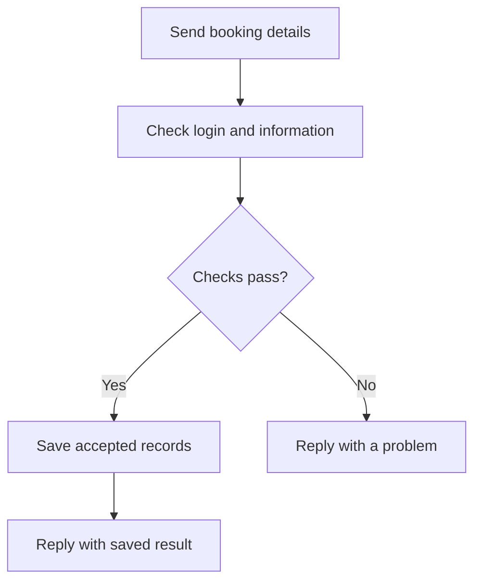

# Request Lifecycle

**Navigate:** [Start Here](../Start%20Here.md) · [Reading order](../Start%20Here.md#recommended-reading-order) · [Backend files](File%20Inventory.md) · [Database tables](../Database/Database%20Overview.md) · [Glossary](../Glossary.md)

## What “request lifecycle” means

It is the journey of one action from the page to the server and back. A **request** asks the server to do something. A **response** is the server’s answer.

## Example: saving Ana’s booking

1. The application sends Ana’s event and service details to the server.
2. The server checks the staff login and booking information.
3. It checks relevant karaoke availability and calculates the price.
4. If the checks pass, it saves records in the database.
5. It replies with the saved result. If a check fails, it returns a problem to handle.



## Terms used in file notes

An **API** is the agreed way the application asks the backend for data or actions. An **endpoint** is the server entry point receiving that request. **JSON** is the structured message format used to carry the information. **HTTP status codes** are numbers that summarize the result; for example, 401 means a login is needed and 409 can mean a direct booking time conflict.

Several related database changes can be saved together in a **transaction**. If that transaction fails and is rolled back, its changes are cancelled together. The exact protection depends on the route used; some errors are not handled uniformly.

## Technical details

This section records exact file behavior, field names and implementation details.

For a direct write such as `POST /api/bookings.php?do=create`:

1. The PHP endpoint includes `config.php`, which sets JSON/CORS headers. OPTIONS is answered before business processing.
2. The endpoint selects its route using HTTP method and `do`.
3. A protected branch calls `requireAuth()` or `requireRole()`. PHP looks up the bearer token in SESSIONS and joins USERS; a local browser flag is not sufficient authorization.
4. `readJsonBody()` decodes the payload. Endpoint/helper checks apply; foreign keys constrain referenced records.
5. `db()` opens a MySQL PDO connection lazily. Prepared statements bind values separately from SQL.
6. A multi-step workflow may start a transaction and lock rows with `FOR UPDATE`. Changes become durable when committed. Sync wraps each individual operation, not its entire batch.
7. `sendJson()` emits a status and envelope, then exits.

```json
{"ok": true, "data": {"booking_id": 42}}
```

```json
{"ok": false, "error": "Time slot already booked.", "code": "conflict"}
```

| Status | Typical meaning |
|---|---|
| 200 | Successful read/update; a sync batch still needs per-operation inspection |
| 201 | Created record on routes that use it |
| 400 | Invalid input |
| 401 / 403 | Missing/invalid session or forbidden role |
| 404 | Record not found on routes that check it |
| 405 | Unsupported route/method |
| 409 | Direct karaoke overlap |
| 500 | Handled server/database failure |

There is no central handler guaranteeing that every exception becomes that JSON shape. Some CRUD/FK SQL errors are uncaught. Not all branch dispatchers strictly enforce method on reads. See [crud.php](Files/crud.php.md) and [Current Implementation Gaps](../Current%20Implementation%20Gaps.md).

## Source files

- [api/config.php](<../../../api/config.php>)
- [api/auth.php](<../../../api/auth.php>)
- [api/bookings.php](<../../../api/bookings.php>)
- [api/sync.php](<../../../api/sync.php>)

## Continue reading

[Previous: Backend Overview](Backend%20Overview.md) · [Next: Database Overview](../Database/Database%20Overview.md) · [Back to Start Here](../Start%20Here.md)
