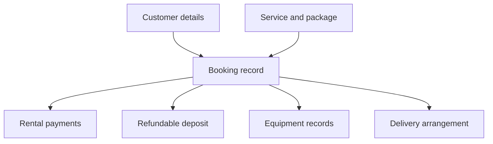
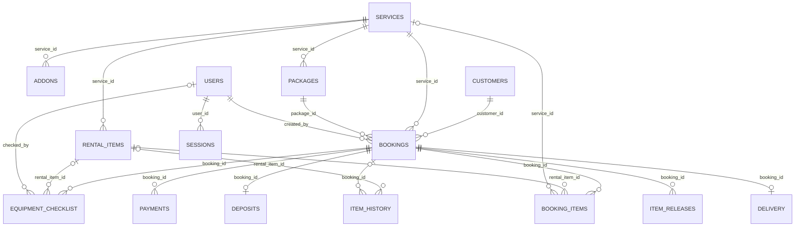

# Table Relationships

**Navigate:** [Start Here](../Start%20Here.md) · [Reading order](../Start%20Here.md#recommended-reading-order) · [Backend files](../Backend/File%20Inventory.md) · [Database tables](Database%20Overview.md) · [Glossary](../Glossary.md)

## Why records are connected

A booking needs to point to the correct customer, service and package. Its payments and equipment records need to point back to the same rental. A relationship is that connection between saved records.

A reference number works like a receipt number on a related payment note: it locates the full rental without repeating all its details.

## Relationship overview

The arrows show how to follow the story. The full technical diagram below shows the exact database links, including accounts and optional references.

## Example

Ana can have more than one booking over time. One booking can have several rental payments. In the current database, one booking can have one current deposit summary and one current delivery arrangement.

A **foreign key** is a storage rule that connects one record’s reference to another record. A **primary key** is the record’s own identifying number. Exact deletion rules matter: deleting a booking can also delete attached financial/equipment records, while some history keeps the entry with its booking link removed.

The overview shows how records connect. The full diagram and constraints specify the database relationships.

## Technical details

This section records exact file behavior, field names and implementation details.

BOOKINGS is the central transaction; catalog/account/customer records are its parents. The diagram reflects current SQL constraints. A required parent means exactly one parent for each child; nullable links can be absent. `o{` means zero or many children; `o|` means zero or one.

### Foreign-key map

| Child column | Parent column |
|---|---|
| [ADDONS](Tables/ADDONS.md) `service_id` | [SERVICES](Tables/SERVICES.md) `service_id` |
| [RENTAL_ITEMS](Tables/RENTAL_ITEMS.md) `service_id` | [SERVICES](Tables/SERVICES.md) `service_id` |
| [PACKAGES](Tables/PACKAGES.md) `service_id` | [SERVICES](Tables/SERVICES.md) `service_id` |
| [BOOKINGS](Tables/BOOKINGS.md) `customer_id` | [CUSTOMERS](Tables/CUSTOMERS.md) `customer_id` |
| [BOOKINGS](Tables/BOOKINGS.md) `service_id` | [SERVICES](Tables/SERVICES.md) `service_id` |
| [BOOKINGS](Tables/BOOKINGS.md) `package_id` | [PACKAGES](Tables/PACKAGES.md) `package_id` |
| [BOOKINGS](Tables/BOOKINGS.md) `created_by` | [USERS](Tables/USERS.md) `user_id` |
| [PAYMENTS](Tables/PAYMENTS.md) `booking_id` | [BOOKINGS](Tables/BOOKINGS.md) `booking_id` |
| [DEPOSITS](Tables/DEPOSITS.md) `booking_id` | [BOOKINGS](Tables/BOOKINGS.md) `booking_id` |
| [EQUIPMENT_CHECKLIST](Tables/EQUIPMENT_CHECKLIST.md) `booking_id` | [BOOKINGS](Tables/BOOKINGS.md) `booking_id` |
| [EQUIPMENT_CHECKLIST](Tables/EQUIPMENT_CHECKLIST.md) `rental_item_id` | [RENTAL_ITEMS](Tables/RENTAL_ITEMS.md) `rental_item_id` |
| [EQUIPMENT_CHECKLIST](Tables/EQUIPMENT_CHECKLIST.md) `checked_by` | [USERS](Tables/USERS.md) `user_id` |
| [BOOKING_ITEMS](Tables/BOOKING_ITEMS.md) `booking_id` | [BOOKINGS](Tables/BOOKINGS.md) `booking_id` |
| [BOOKING_ITEMS](Tables/BOOKING_ITEMS.md) `rental_item_id` | [RENTAL_ITEMS](Tables/RENTAL_ITEMS.md) `rental_item_id` |
| [BOOKING_ITEMS](Tables/BOOKING_ITEMS.md) `service_id` | [SERVICES](Tables/SERVICES.md) `service_id` |
| [ITEM_RELEASES](Tables/ITEM_RELEASES.md) `booking_id` | [BOOKINGS](Tables/BOOKINGS.md) `booking_id` |
| [ITEM_HISTORY](Tables/ITEM_HISTORY.md) `rental_item_id` | [RENTAL_ITEMS](Tables/RENTAL_ITEMS.md) `rental_item_id` |
| [ITEM_HISTORY](Tables/ITEM_HISTORY.md) `booking_id` | [BOOKINGS](Tables/BOOKINGS.md) `booking_id` |
| [DELIVERY](Tables/DELIVERY.md) `booking_id` | [BOOKINGS](Tables/BOOKINGS.md) `booking_id` |
| [SESSIONS](Tables/SESSIONS.md) `user_id` | [USERS](Tables/USERS.md) `user_id` |

### What deletion does

- Deleting a booking cascades to its payments, deposit, delivery, assigned booking items, saved inspections and release events. ITEM_HISTORY keeps the row but its booking reference becomes NULL.
- Deleting a customer, service, package or creating user can be blocked while required references exist (`RESTRICT`). Deleting a user cascades its sessions and sets inspection checked_by to NULL where applicable.
- Deleting a rental item sets the linked booking-item/inspection/history reference to NULL. Saved names can survive, but complete inspection needs valid catalog item IDs.
- `ON UPDATE CASCADE` propagates referenced key changes. The application normally uses generated stable IDs.

Check each table note for exact constraints. The database does not enforce package_id and service_id as a matching pair on BOOKINGS; PHP pricing does. JSON service/add-on selections have no SQL foreign keys. CATEGORIES, GALLERY, WEBSITE_CONTENT and APP_SETTINGS have no relational parents/children.

### Design text versus current cardinality

The official design's narrative calls deposits and delivery one-to-many. Current schema has UNIQUE booking_id in each, making them zero-or-one records per booking. This guide shows current storage; it does not revise the official design.

## Source files

- [db/schema.sql](<../../../db/schema.sql>)
- [db/seed.sql](<../../../db/seed.sql>)
- [Documentation/AKAD_System_Design.md](<../../../Documentation/AKAD_System_Design.md>)

## Continue reading

[Previous: Database Overview](Database%20Overview.md) · [Next: Login and Authentication](../Workflows/Login%20and%20Authentication.md) · [Back to Start Here](../Start%20Here.md)
