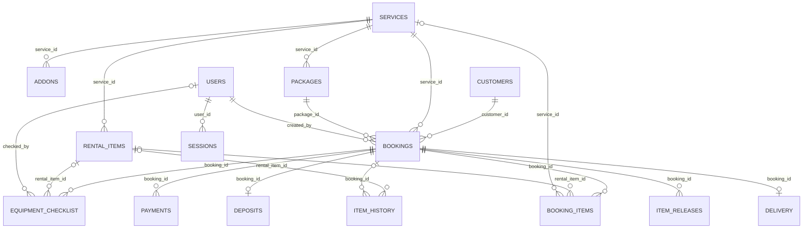

# Table Relationships

BOOKINGS is the central transaction; catalog/account/customer records are its parents. The diagram reflects current SQL constraints. A required parent means exactly one parent for each child; nullable links can be absent. `o{` means zero or many children; `o|` means zero or one.

## Foreign-key map

| Child column | Parent column |
|---|---|
| [[System Understanding/Database/Tables/ADDONS\|ADDONS]] `service_id` | [[System Understanding/Database/Tables/SERVICES\|SERVICES]] `service_id` |
| [[System Understanding/Database/Tables/RENTAL_ITEMS\|RENTAL_ITEMS]] `service_id` | [[System Understanding/Database/Tables/SERVICES\|SERVICES]] `service_id` |
| [[System Understanding/Database/Tables/PACKAGES\|PACKAGES]] `service_id` | [[System Understanding/Database/Tables/SERVICES\|SERVICES]] `service_id` |
| [[System Understanding/Database/Tables/BOOKINGS\|BOOKINGS]] `customer_id` | [[System Understanding/Database/Tables/CUSTOMERS\|CUSTOMERS]] `customer_id` |
| [[System Understanding/Database/Tables/BOOKINGS\|BOOKINGS]] `service_id` | [[System Understanding/Database/Tables/SERVICES\|SERVICES]] `service_id` |
| [[System Understanding/Database/Tables/BOOKINGS\|BOOKINGS]] `package_id` | [[System Understanding/Database/Tables/PACKAGES\|PACKAGES]] `package_id` |
| [[System Understanding/Database/Tables/BOOKINGS\|BOOKINGS]] `created_by` | [[System Understanding/Database/Tables/USERS\|USERS]] `user_id` |
| [[System Understanding/Database/Tables/PAYMENTS\|PAYMENTS]] `booking_id` | [[System Understanding/Database/Tables/BOOKINGS\|BOOKINGS]] `booking_id` |
| [[System Understanding/Database/Tables/DEPOSITS\|DEPOSITS]] `booking_id` | [[System Understanding/Database/Tables/BOOKINGS\|BOOKINGS]] `booking_id` |
| [[System Understanding/Database/Tables/EQUIPMENT_CHECKLIST\|EQUIPMENT_CHECKLIST]] `booking_id` | [[System Understanding/Database/Tables/BOOKINGS\|BOOKINGS]] `booking_id` |
| [[System Understanding/Database/Tables/EQUIPMENT_CHECKLIST\|EQUIPMENT_CHECKLIST]] `rental_item_id` | [[System Understanding/Database/Tables/RENTAL_ITEMS\|RENTAL_ITEMS]] `rental_item_id` |
| [[System Understanding/Database/Tables/EQUIPMENT_CHECKLIST\|EQUIPMENT_CHECKLIST]] `checked_by` | [[System Understanding/Database/Tables/USERS\|USERS]] `user_id` |
| [[System Understanding/Database/Tables/BOOKING_ITEMS\|BOOKING_ITEMS]] `booking_id` | [[System Understanding/Database/Tables/BOOKINGS\|BOOKINGS]] `booking_id` |
| [[System Understanding/Database/Tables/BOOKING_ITEMS\|BOOKING_ITEMS]] `rental_item_id` | [[System Understanding/Database/Tables/RENTAL_ITEMS\|RENTAL_ITEMS]] `rental_item_id` |
| [[System Understanding/Database/Tables/BOOKING_ITEMS\|BOOKING_ITEMS]] `service_id` | [[System Understanding/Database/Tables/SERVICES\|SERVICES]] `service_id` |
| [[System Understanding/Database/Tables/ITEM_RELEASES\|ITEM_RELEASES]] `booking_id` | [[System Understanding/Database/Tables/BOOKINGS\|BOOKINGS]] `booking_id` |
| [[System Understanding/Database/Tables/ITEM_HISTORY\|ITEM_HISTORY]] `rental_item_id` | [[System Understanding/Database/Tables/RENTAL_ITEMS\|RENTAL_ITEMS]] `rental_item_id` |
| [[System Understanding/Database/Tables/ITEM_HISTORY\|ITEM_HISTORY]] `booking_id` | [[System Understanding/Database/Tables/BOOKINGS\|BOOKINGS]] `booking_id` |
| [[System Understanding/Database/Tables/DELIVERY\|DELIVERY]] `booking_id` | [[System Understanding/Database/Tables/BOOKINGS\|BOOKINGS]] `booking_id` |
| [[System Understanding/Database/Tables/SESSIONS\|SESSIONS]] `user_id` | [[System Understanding/Database/Tables/USERS\|USERS]] `user_id` |

## What deletion does

- Deleting a booking cascades to its payments, deposit, delivery, assigned booking items, saved inspections and release events. ITEM_HISTORY keeps the row but its booking reference becomes NULL.
- Deleting a customer, service, package or creating user can be blocked while required references exist (`RESTRICT`). Deleting a user cascades its sessions and sets inspection checked_by to NULL where applicable.
- Deleting a rental item sets the linked booking-item/inspection/history reference to NULL. Saved names can survive, but complete inspection needs valid catalog item IDs.
- `ON UPDATE CASCADE` propagates referenced key changes. The application normally uses generated stable IDs.

Check each table note for exact constraints. The database does not enforce package_id and service_id as a matching pair on BOOKINGS; PHP pricing does. JSON service/add-on selections have no SQL foreign keys. CATEGORIES, GALLERY, WEBSITE_CONTENT and APP_SETTINGS have no relational parents/children.

## Design text versus current cardinality

The official design's narrative calls deposits and delivery one-to-many. Current schema has UNIQUE booking_id in each, making them zero-or-one records per booking. This guide shows current storage; it does not revise the official design.

## Source files

- [db/schema.sql](<../../../db/schema.sql>)
- [db/seed.sql](<../../../db/seed.sql>)
- [Documentation/AKAD_System_Design.md](<../../../Documentation/AKAD_System_Design.md>)

Return to [[System Understanding/Start Here|Start Here]].
