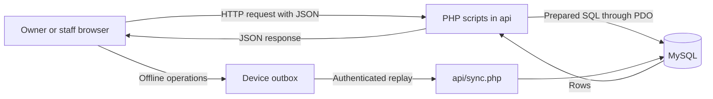

# System Overview

AKAD uses an internal staff/owner tool to organize karaoke, Sweet Corner and balloon-decoration bookings. PHP handles server requests; MySQL holds shared business records. Customers are rental contacts in the database, not authenticated application users.

The PHP files are individual HTTP entry points, rather than routes in a framework. `?do=...` selects an action. Helper files supply connection, authentication, price calculation, deposit calculation, inspection and replay state. MySQL foreign keys enforce record references; PHP supplies rules such as package compatibility and karaoke overlap prevention.

BOOKINGS is the center: it links a customer, primary service, package and creating user. Payments, deposit, delivery and equipment data attach to that booking. Catalog tables supply services, prices and reusable item templates. Configuration/content tables hold JSON. SESSIONS holds login tokens; APP_SETTINGS row 2 holds replay receipts.

Offline entry does not run PHP or MySQL on the device. A supported local action is queued and later validated by the server. Other devices learn about accepted records by reads/refresh, not by direct access to another device's queue. See [[System Understanding/Workflows/Offline Synchronization]].

The official design describes nine core entities; the current SQL scripts define 19 tables including support/catalog tables and SESSIONS. See [[System Understanding/Database/Database Overview]] and [[System Understanding/Current Implementation Gaps]].

## Source files

- [Documentation/AKAD_System_Design.md](<../../Documentation/AKAD_System_Design.md>)
- [api/config.php](<../../api/config.php>)
- [api/sync.php](<../../api/sync.php>)

Return to [[System Understanding/Start Here|Start Here]].
