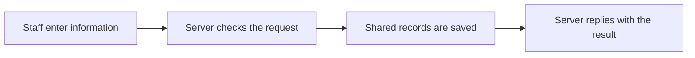
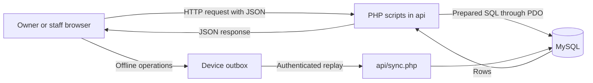

# System Overview

**Navigate:** [Start Here](Start%20Here.md) · [Reading order](Start%20Here.md#recommended-reading-order) · [Backend files](Backend/File%20Inventory.md) · [Database tables](Database/Database%20Overview.md) · [Glossary](Glossary.md)

## What the system is for

AKAD needs a shared place for owners and staff to keep track of rentals. The business offers karaoke, Sweet Corner and balloon-decoration services. Staff enter the information; the backend checks and saves it so accepted records can be retrieved by other connected staff devices.

Three parts work together:

| Part | Plain meaning | Example |
|---|---|---|
| Frontend | The pages and controls people use | Staff enter event details |
| Backend | The server instructions that check and process requests | Check a karaoke time and calculate the price |
| Database | The organized saved records | Keep the booking, payments and equipment information |

The frontend is still being finished. This guide teaches the backend and database.

## One example throughout the guide

Ana wants karaoke on October 20, 2026, from 2 PM to 6 PM. In our example, the selected package costs ₱2,500, an extra microphone costs ₱300, the discount is ₱100 and the additional fee is ₱50. The rental total is ₱2,750. Ana pays ₱250 toward it, leaving ₱2,500. A separate ₱350 deposit with a ₱50 cleaning deduction leaves a calculated ₱300 refund.

These illustrative values follow one booking through its related records. No example request was sent to the system, and no actual customer record is implied.

## How the records fit

The booking is the central rental record. Its reference number connects customer details, payments, deposit, delivery and equipment records. Catalog records supply the service choices, package prices and equipment templates.

If the server cannot be reached, supported changes can stay on the device as Pending Sync. They become shared records only after the server accepts them. That process is called synchronization.

Start with [Booking and Pricing](Workflows/Booking%20and%20Pricing.md) for the booking story. Keep [Current Implementation Gaps](Current%20Implementation%20Gaps.md) in mind when writing about what is finished.

## Technical details

This section records exact file behavior, field names and implementation details.

AKAD uses an internal staff/owner tool to organize karaoke, Sweet Corner and balloon-decoration bookings. PHP handles server requests; MySQL holds shared business records. Customers are rental contacts in the database, not authenticated application users.

The PHP files are individual HTTP entry points, rather than routes in a framework. `?do=...` selects an action. Helper files supply connection, authentication, price calculation, deposit calculation, inspection and replay state. MySQL foreign keys enforce record references; PHP supplies rules such as package compatibility and karaoke overlap prevention.

BOOKINGS is the center: it links a customer, primary service, package and creating user. Payments, deposit, delivery and equipment data attach to that booking. Catalog tables supply services, prices and reusable item templates. Configuration/content tables hold JSON. SESSIONS holds login tokens; APP_SETTINGS row 2 holds replay receipts.

Offline entry does not run PHP or MySQL on the device. A supported local action is queued and later validated by the server. Other devices learn about accepted records by reads/refresh, not by direct access to another device's queue. See [Offline Synchronization](Workflows/Offline%20Synchronization.md).

The official design describes nine core entities; the current SQL scripts define 19 tables including support/catalog tables and SESSIONS. See [Database Overview](Database/Database%20Overview.md) and [Current Implementation Gaps](Current%20Implementation%20Gaps.md).

## Source files

- [Documentation/AKAD_System_Design.md](<../../Documentation/AKAD_System_Design.md>)
- [api/config.php](<../../api/config.php>)
- [api/sync.php](<../../api/sync.php>)

## Continue reading

[Previous: Start Here](Start%20Here.md) · [Next: Backend Overview](Backend/Backend%20Overview.md) · [Back to Start Here](Start%20Here.md)
