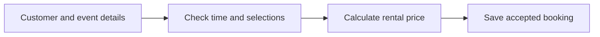

# Booking and Pricing

**Navigate:** [Start Here](../Start%20Here.md) · [Reading order](../Start%20Here.md#recommended-reading-order) · [Backend files](../Backend/File%20Inventory.md) · [Database tables](../Database/Database%20Overview.md) · [Glossary](../Glossary.md)

## The purpose

A booking records who is renting, the event details and the selected primary service/package. Its booking number connects the later money, delivery and equipment records.

## Follow Ana’s booking

1. Staff identify Ana and enter October 20, 2 PM to 6 PM, with a venue.
2. They select karaoke and a package.
3. The backend checks the details and relevant karaoke availability.
4. It reads the saved package/extra prices and calculates the rental total.
5. Accepted information is saved with the staff account that created it. The new booking starts unpaid.

## Price in ordinary numbers

Ana’s example: ₱2,500 package + ₱300 extra − ₱100 discount + ₱50 fee = **₱2,750 rental total**. A refundable deposit is separate. Delivery charges are not automatically added by the delivery-record handler.

## What a time conflict means

The single karaoke set cannot serve overlapping blocking bookings on the same date. If one blocking karaoke booking runs from 2 PM to 6 PM, another blocking karaoke booking from 4 PM to 7 PM conflicts. One ending exactly when another starts does not overlap. A pending booking does not reserve the slot under current code.

## Key points

“The backend checks the rental details and calculates a price from its saved catalog before accepting the booking.” The direct and offline-save paths have differences described below. A booking saved locally is still awaiting acceptance.

See [bookings.php](../Backend/Files/bookings.php.md), [booking_pricing.php](../Backend/Files/booking_pricing.php.md) and [BOOKINGS](../Database/Tables/BOOKINGS.md).

## Technical details

This section records exact file behavior, field names and implementation details.

A booking ties together a renter, an event date/time/location, a primary service/package, prices and the staff account that created it. These are not separate disconnected calendar entries: the saved booking ID links finance, logistics and equipment.

### Direct create/update

1. Authenticate the writer and start a transaction. Lock service row 1 to serialize competing karaoke writes.
2. Resolve the customer. Direct create accepts an existing customer ID or name/contact; it may reuse a contact and update that customer.
3. Validate the date and same-day start/end times.
4. Resolve the first service and selected package. If omitted, choose the first package for the primary service.
5. When the primary service is id 1 and status is confirmed/reserved/preparing/released, test overlap with existing blocking karaoke bookings.
6. Validate package/add-ons against that service and calculate totals from current database prices.
7. Insert/update BOOKINGS and commit. New bookings start with amount_paid=0 and payment_status=Unpaid. Creation records the authenticated account as created_by.

### Price example

Suppose an existing package costs 2,500, selected distinct extras total 300, discount is 100 and fees are 50. The rental total is `max(2500 + 300 - 100 + 50, 0) = 2750`. A held deposit is separate and does not raise this rental total. Delivery fee is also not automatically copied into BOOKINGS.fees.

### Karaoke conflict rule

Intervals overlap when `existing.start_time < requested.end_time` and `existing.end_time > requested.start_time`, on the same event date and primary karaoke service. Adjacent intervals such as 14:00–16:00 and 16:00–18:00 do not overlap. Current code recognizes service id 1 as karaoke; pending bookings do not reserve the slot.

Direct overlap produces HTTP 409. Sync returns an item in conflicts instead, keeping the draft available for review. A sync service-only edit is a documented gap in overlap triggering. See [Current Implementation Gaps](../Current%20Implementation%20Gaps.md).

### Further operations

The direct booking endpoint does not automatically create its equipment assignment. The current browser sync adapter queues bookingItems.generate after a booking create; callers using direct HTTP must arrange checklist generation separately.

The intended lifecycle is reflected by labels such as pending, confirmed, preparing, released and completed, but BOOKINGS.status is a VARCHAR and booking writes do not enforce a full state machine. Guarded return completion is implemented through equipment.finalizeReturn; it is not a universal guard on every booking status update.

## Source files

- [api/bookings.php](<../../../api/bookings.php>)
- [api/booking_pricing.php](<../../../api/booking_pricing.php>)
- [api/sync.php](<../../../api/sync.php>)
- [js/sync.js](<../../../js/sync.js>)

## Continue reading

[Previous: Login and Authentication](Login%20and%20Authentication.md) · [Next: Payments and Deposits](Payments%20and%20Deposits.md) · [Back to Start Here](../Start%20Here.md)
