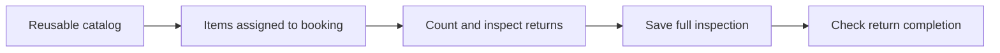

# Equipment Release and Return

## The purpose

Equipment tracking connects the reusable item catalog, the items assigned to a rental, and the inspection saved when they return.

## Follow Ana’s equipment

1. A booking-specific list is copied from the service’s equipment catalog.
2. Release quantities and a handover note can be recorded separately.
3. Staff count every assigned item at return and record condition and notes.
4. The backend saves the full checked inspection together.
5. The return-completion action checks that all quantities are back and no item is marked Missing before completing the booking.

If two microphones were expected and only one returned, the missing quantity can be saved. That short return prevents completion through the guarded return action. Fully returned damaged items may complete, but a deposit deduction is a separate decision/action.

## What to explain to another person

“The assigned list says what should return; the saved inspection records what actually returned.” Generating the list again replaces its progress. Catalog stock is not automatically reduced, and the guarded completion check is not enforced on every direct booking-status edit.

See [[System Understanding/Database/Tables/BOOKING_ITEMS|BOOKING_ITEMS]], [[System Understanding/Database/Tables/EQUIPMENT_CHECKLIST|EQUIPMENT_CHECKLIST]] and [[System Understanding/Backend/Files/equipment_service.php|equipment_service.php]].

## Technical reference (optional)

Read this part when you need exact file behavior, field names or developer details. The explanation above is the first-pass reading.

There are four related stores with different jobs:

| Table | Job |
|---|---|
| RENTAL_ITEMS | Reusable per-service catalog |
| BOOKING_ITEMS | Assigned item snapshot, expected/released/returned quantities |
| EQUIPMENT_CHECKLIST | Saved outgoing/incoming condition and inspection outcome |
| ITEM_RELEASES / ITEM_HISTORY | Explicit release metadata and equipment events |

### Assignment and release

bookingItems.generate deletes previous assigned rows for a booking and copies the selected services' catalog items. It copies names, quantities and required flags, not a live reservation of catalog stock. Updating release quantities/check flags and writing ITEM_RELEASES are explicit operations. A release record alone does not change status or inventory automatically.

### Saving a complete return inspection

Send every assigned catalog-linked item once, including returned quantity, condition and notes. For example, an expected quantity of two may return zero with condition Missing; zero remains a valid stored quantity.

The service checks the booking and expected items, locks matching BOOKING_ITEMS, rejects duplicate/unknown item IDs, excessive quantities, invalid conditions and incomplete inspections. In one transaction it updates BOOKING_ITEMS and upserts EQUIPMENT_CHECKLIST. checked_by comes from the authenticated inspector.

Condition choices are Good, Minor Damage, Damaged, Missing. Short quantity or Missing yields return_status=missing; a Damage condition yields damaged; otherwise inspected. Notes are at most 2,000 bytes.

### Completing the return

finalizeReturn reloads the saved inspections, revalidates the full checklist and rejects any short/Missing return. Fully returned damaged equipment can complete. It then sets BOOKINGS.status=completed. It does not automatically calculate a damage deduction, refund a deposit, settle balance, restore catalog stock or append history.

This guard belongs to finalizeReturn. A direct booking update can set completed without it, so teaching material must not claim every completion path enforces inspection. Nullable/unlinked manual rows and duplicate assignments can also prevent full inspection.

See [[System Understanding/Backend/Files/bookingItems.php|bookingItems.php]], [[System Understanding/Backend/Files/equipment_service.php|equipment_service.php]] and [[System Understanding/Current Implementation Gaps]].

## Source files

- [api/bookingItems.php](<../../../api/bookingItems.php>)
- [api/equipment_service.php](<../../../api/equipment_service.php>)
- [api/equipment.php](<../../../api/equipment.php>)
- [api/itemReleases.php](<../../../api/itemReleases.php>)
- [api/itemHistory.php](<../../../api/itemHistory.php>)

Return to [[System Understanding/Start Here|Start Here]].
