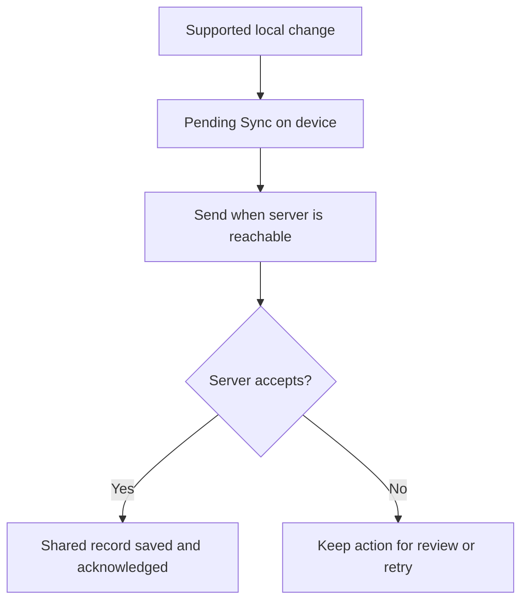

# Offline Synchronization

**Navigate:** [Start Here](../Start%20Here.md) · [Reading order](../Start%20Here.md#recommended-reading-order) · [Backend files](../Backend/File%20Inventory.md) · [Database tables](../Database/Database%20Overview.md) · [Glossary](../Glossary.md)

## The purpose

Offline support lets a previously prepared device keep supported changes while the server cannot be reached. Synchronization sends those changes to the shared database later.

## Follow Ana’s saved draft

1. Staff save a supported change locally. It shows Pending Sync: stored on this device, awaiting server acceptance.
2. When the server is reachable and the login is valid, the device sends its waiting actions.
3. The server checks each one for valid information, permissions, conflicts and previous acceptance.
4. Accepted changes are saved in the shared database. Acknowledgement tells the device which actions succeeded.
5. Conflicts and failures remain for review or retry. Other devices can retrieve accepted records on refresh/read.



## Why the server remembers accepted actions

Suppose Ana’s queued payment is saved but the reply is lost. Repeating the same queued action should not create another payment. The server remembers its acknowledgement, called a receipt, and returns the earlier result. This protection applies to the sync route.

## Key points

“Saved on this device” and “accepted into shared records” are different stages. Pending Sync does not promise acceptance. The device must first have an authenticated/cached setup; conflicts, expired logins or an unreachable server can delay upload.

See [sync.php](../Backend/Files/sync.php.md), [sync_state.php](../Backend/Files/sync_state.php.md) and [APP_SETTINGS](../Database/Tables/APP_SETTINGS.md).

## Technical details

This section records exact file behavior, field names and implementation details.

A device first saves a supported local operation. On reconnect it submits that operation to PHP, which validates and writes MySQL. A local draft is not yet an accepted shared record. This note explains the server protocol; the frontend guide remains deferred.

### Operation envelope

```json
{
  "queue": [{
    "client_id": "unique-operation-id",
    "owner_id": 1,
    "entity": "bookings",
    "action": "create",
    "local_id": "LOCAL-bookings-example",
    "data": {
      "customer_name": "Example Renter",
      "contact": "example-contact",
      "event_date": "2026-10-20",
      "start_time": "14:00",
      "end_time": "18:00",
      "service_ids": [1],
      "package_id": 1,
      "status": "pending"
    }
  }]
}
```

This is illustrative; no request was sent. Actual IDs/catalog records must exist. Submit to POST /api/sync.php?do=commit with a valid bearer token. Maximum 100 operations per request.

### Per-operation processing

1. Verify session and operation identity, user ownership and entity permissions.
2. Hash original entity, action, data and local_id. Begin transaction and lock APP_SETTINGS row 2.
3. If user+client_id was acknowledged with the same hash, return the stored acknowledgement without repeating the write. A changed acknowledged payload is rejected.
4. Resolve temporary IDs from user-scoped mappings. Related creates must have succeeded earlier; unresolved dependencies remain failed for retry/review.
5. Validate and apply the entity/action branch. A stale booking _base or karaoke clash becomes a conflict. Other failures roll back that operation.
6. Store receipt, optional local-to-server mapping and business change together; commit. Continue with the next operation.

An acknowledgement includes client_id, entity, server_id (where one is available) and data. Results contain committed, conflicts and failed arrays. HTTP 200 with ok:true does not mean every operation committed. The whole batch is not atomic.

### Supported operations

| Entity | Actions |
|---|---|
| bookings | create, update, delete |
| payments | create |
| deposits / delivery | upsert |
| bookingItems | generate, create, update, delete |
| equipment | inspect, finalizeReturn, plus generic create/update/delete |
| settings / websiteContent | update |
| services, categories, addons, packages, customers, rentalItems, gallery, itemReleases, itemHistory | generic create/update/delete |

Owner-only entity group: services, categories, addons, packages, customers, rentalItems, gallery, settings, websiteContent. Other supported branches allow authenticated staff/owner; this differs from several owner-only direct CRUD routes.

### Conflicts and retry

Booking _base compares selected status/date/start/end/location values with current server data. It is not a universal version check for every field/entity. Karaoke conflict returns a server record for review. Failed dependency operations remain pending locally for a later valid retry. A lost response after commit can be safely retried with the same immutable operation ID and payload because its receipt already exists.

The browser uses an operation outbox, LOCAL- IDs and a 15-second retry with startup/reconnect/focus triggers. GET sync.php?do=queue returns an empty compatibility response; the server does not host the browser outbox.

APP_SETTINGS row 2 holds receipts and ids. This single locked JSON row serializes all operation commits and grows without retention. Do not erase receipts casually: replay protection depends on them.

### Evidence and practical bounds

Existing 2026-09-28 evidence records 14 integration checks and an actual backend-outage browser workflow. This guide does not rerun those tests. Offline setup needs a previously authenticated/cached session, HTTPS or localhost and available storage. Conflicts, expired tokens, suspended browsers and unreachable servers prevent guaranteed reconnect timing. See [Supporting Files and Evidence](../Backend/Supporting%20Files%20and%20Evidence.md) and [Current Implementation Gaps](../Current%20Implementation%20Gaps.md).

## Source files

- [api/sync.php](<../../../api/sync.php>)
- [api/sync_state.php](<../../../api/sync_state.php>)
- [js/sync.js](<../../../js/sync.js>)
- [Implementation/Offline-Sync-Verification-2026-09-28.md](<../../../Implementation/Offline-Sync-Verification-2026-09-28.md>)

## Continue reading

[Previous: Equipment Release and Return](Equipment%20Release%20and%20Return.md) · [Next: Reports](Reports.md) · [Back to Start Here](../Start%20Here.md)
